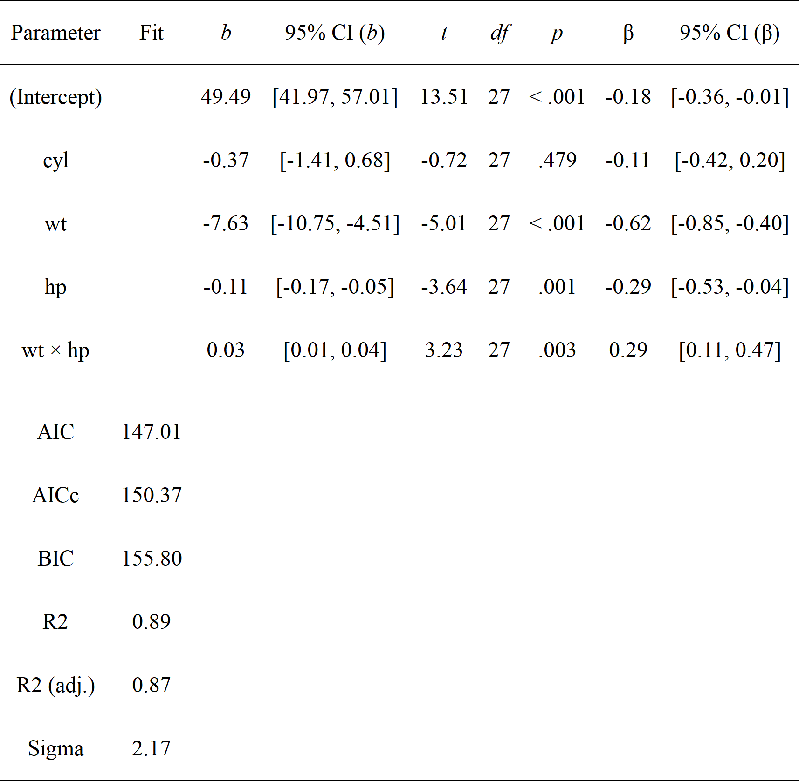
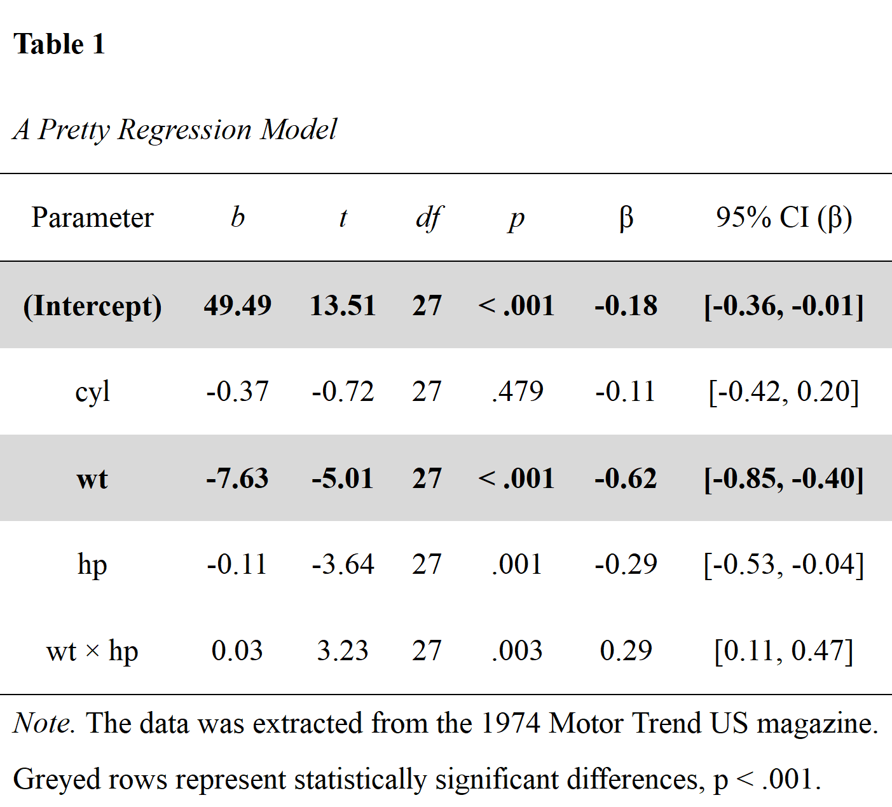
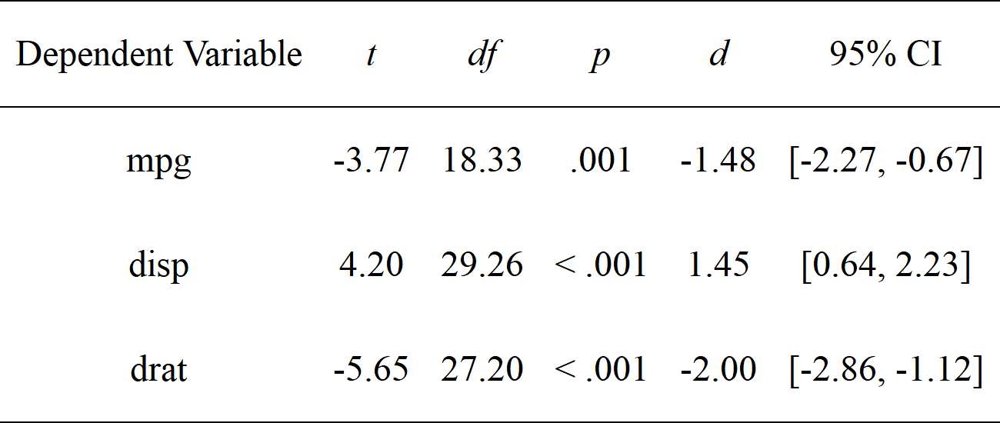
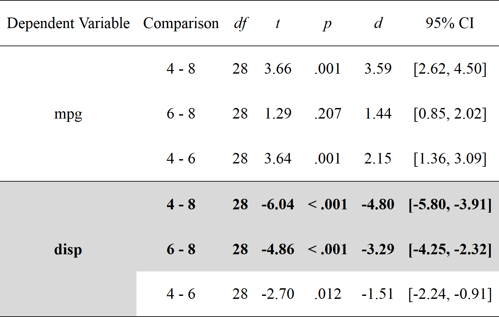
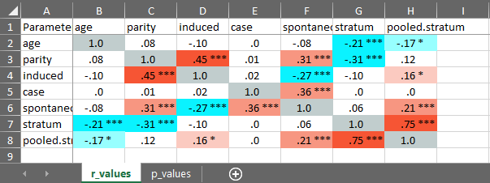
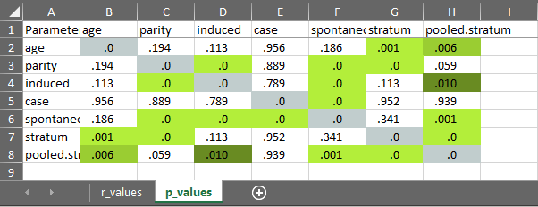
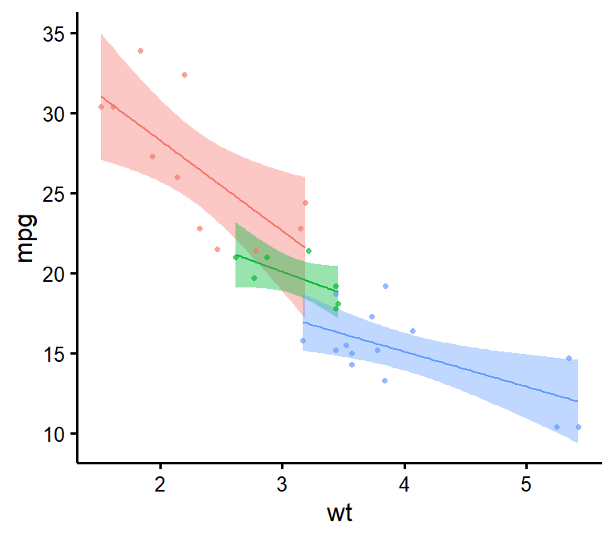
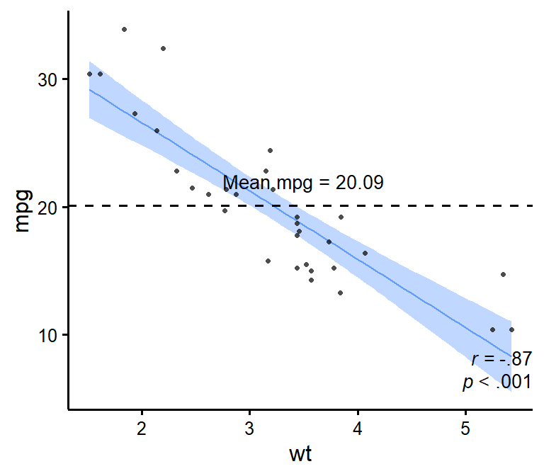
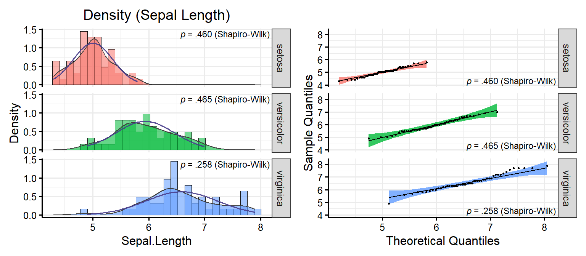
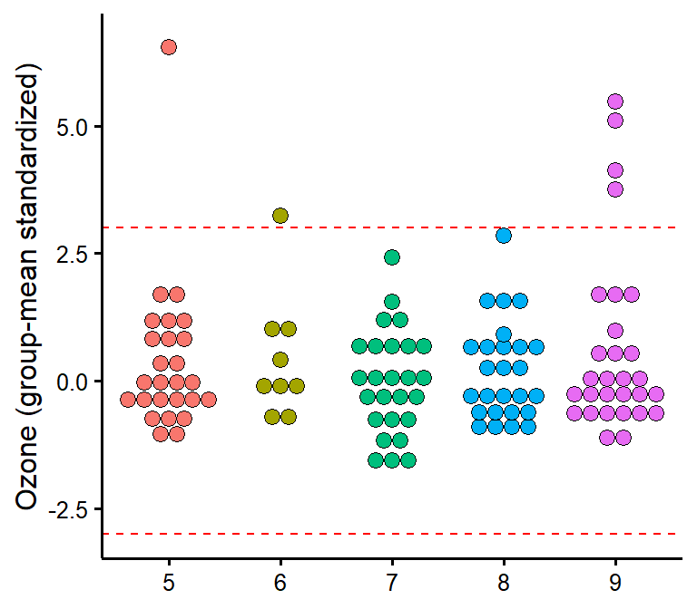

# Summary

{rempsyc} is an R package of convenience functions that make the
analysis-to-publication workflow faster, easier, and less error-prone.
It affords easily customizable APA plots (via {ggplot2}) and nice APA
tables exportable to Word (via {flextable}). It makes it easy to run
statistical tests, check assumptions, and automatize various tasks. It
is a package mostly geared at researchers in the psychological sciences
but people from all fields can benefit from it.

# Statement of need

There are many reasons to use R ([R Core Team 2022](#ref-base2021)) for
analyzing and reporting data from research studies. R is more compatible
with the ideals of open science ([Quintana 2020](#ref-quintana2020)). In
contrast to commercial software: (a) it is free to use; (b) it makes it
easy to share a fully comprehensive analysis script; (c) it is
transparent as anyone can look at the formulas or algorithms used in a
given package; (d) the community can quickly contribute new packages
based on current needs; (e) it generates better-looking figures; and (f)
it helps reduce copy-paste errors so common in psychology. The latter
point is a substantial one because according to some estimates, up to
50% of articles in psychology have at least one statistical error
([Nuijten et al. 2016](#ref-nuijten2016prevalence)).

However, R has a major downside for R novices: its steep learning curve
due to its programmatic interface, in contrast to perhaps more
user-friendly point-and-click software. Of course, this flexibility is
also a strength, as the R community can, and increasingly does, mobilize
to produce packages that make using R as easy as possible (e.g., the
*easystats* ecosystem [Lüdecke et al. \[2019\]
2023](#ref-easystatsPackage)). The {rempsyc} package contributes to this
momentum by providing convenience functions that remove as much friction
as possible between your script and your manuscript (in particular, if
you are using Microsoft Word).

There are mainly three things that go into a manuscript: text, tables,
and figures. {rempsyc} does not generate publication-ready text
summarizing analyses; for this, see the {report} package ([Makowski et
al. \[2021\] 2023](#ref-reportPackage)). Instead, {rempsyc} focuses on
the production of publication-ready tables and figures. Below, I go over
a few quick examples of those.

# Examples Features

## Publication-Ready Tables

Formatting your table properly in R is already a time-consuming task,
but fortunately several packages take care of the formatting within R
\[e.g., the {broom} or {report} packages, Robinson, Hayes, and Couch
([2022](#ref-broom2022)); Makowski et al. ([\[2021\]
2023](#ref-reportPackage)); and there are several others\]. Exporting
these formatted tables to Microsoft Word remains a challenge however.
Some packages do export to Word (e.g., [Stanley and Spence
2018](#ref-stanley2018reproducible)), but their formatting is often
rigid especially when using analyzes that are not supported by default.

{rempsyc} solves this problem by allowing maximum flexibility: you
manually create the data frame exactly the way you want, and then only
use the magical function, `nice_table()`, on the resulting data frame.
`nice_table()` works on any data frame, even non-statistical ones like
`mtcars`.

One of its main benefit however is the automatic formatting of
statistical symbols and its integration with other packages. We can for
example create a {broom} table and then apply `nice_table()` on it. It
suits particularly well the pipe workflow.

    library(rempsyc)
    library(broom)
    model <- lm(mpg ~ cyl + wt * hp, mtcars)
    tidy(model, conf.int = TRUE) |>
      nice_table(broom = "lm")

<figure>

<figcaption aria-hidden="true">Caption for example figure.</figcaption>
</figure>

We can do the same with a {report} table.

    library(report)
    model <- lm(mpg ~ cyl + wt * hp, mtcars)
    stats.table <- as.data.frame(report(model))

    nice_table(stats.table)

The {report} package provides quite comprehensive tables, so one may
request an abbreviated table with the `short` argument.

    nice_table(stats.table, short = TRUE)

For convenience, it is also possible to highlight significant results
for better visual discrimination, using the `highlight` argument[1].
Once satisfied with the table, we can add a title and note.

    my_table <- nice_table(
      stats.table, short = TRUE, highlight = 0.001,
      title = c("Table 1", "A Pretty Regression Model"),
      note = c("The data was extracted from the 1974 Motor Trend US magazine.",
               "* p < .05, ** p < .01, *** p < .001"))
    my_table

One can then easily save the resulting table to Word with
`flextable::save_as_docx()`, specifying the object name and desired
path.

    flextable::save_as_docx(my_table, path = "nice_tablehere.docx")

Additionally, tables created with `nice_table()` are {flextable} objects
([Gohel and Skintzos 2022](#ref-flextable2022)), and can be modified as
such[2].

## Formattting Results of Analyses

{rempsyc} also provides its own set of functions to prepare statistical
tables before they can be fed to `nice_table()` and saved to Word.

### *t* tests

    nice_t_test(data = mtcars,
                response = c("mpg", "disp", "drat"),
                group = "am",
                warning = FALSE) |>
      nice_table()

### Contrasts

    nice_contrasts(data = mtcars,
                   response = c("mpg", "disp"),
                   group = "cyl",
                   covariates = "hp") |>
      nice_table(highlight = .001)

### Regressions

    model1 <- lm(mpg ~ cyl + wt * hp, mtcars)
    model2 <- lm(qsec ~ disp + drat * carb, mtcars)

    nice_lm(list(model1, model2)) |>
      nice_table(highlight = TRUE)

### Simple Slopes

    model1 <- lm(mpg ~ gear * wt, mtcars)
    model2 <- lm(disp ~ gear * wt, mtcars)
    my.models <- list(model1, model2)

    nice_lm_slopes(my.models, predictor = "gear", moderator = "wt") |>
      nice_table()

### Correlation Matrix

It is also possible to export a colour-coded correlation matrix to
Microsoft Excel. The `cormatrix_excel()` function has several benefits
over conventional approaches. The base R `cor()` function for example
does not use rounded values and the console is impractical for large
matrices. One may manually round values and export it to a `.csv` file,
which is an improvement but still unsatisfying.

The {apaTables} package ([Stanley and Spence
2018](#ref-stanley2018reproducible)) allows exporting the correlation
matrix to Word in an APA format, and in many cases this is very
satifying for APA requirements. Hovever, the Word format is not suitable
for large matrices, as it will often spread beyond the document’s margin
limits.

Another approach is to export to an image, like {correlation} package
does ([Makowski et al. 2020](#ref-correlationpackage)). For very small
matrices, this works extremely well, and the colour is an immense help
to quickly identify which correlations are strong or weak, positive or
negative. Again, however, this does not work so well for large matrices
because labels might overlap or navigating the large figure becomes
difficult.

When the goal is more exploratory, rather than reporting, and we have
large matrices, it can be more useful to export it to Excel. In
{rempsyc}, we combine the idea of using a coloured correlation matrix
from the {correlation} package with the idea of exporting to Excel using
{openxlsx2} ([Barbone and Garbuszus 2023](#ref-openxlsx2package)).

We also provide some quality of life-improvements, like freezing the
first row and column so as to be able to easily see to which variables
the correlations relate, regardless of how far or deep we are within the
large correlation matrix.

The colour represents the strength of the correlation, whereas the stars
represent how significant the *p* value is.[3] The exact *p* values are
provided in a second tab for reference purposes, so all information is
readily available in a convenient format.

    cormatrix_excel(data = infert, 
                    filename = "cormatrix1", 
                    select = c("age", "parity", "induced", "case", "spontaneous", 
                               "stratum", "pooled.stratum"))

 

## Publication-Ready Figures

Preparing figures according to APA style, having them look good, and
being able to save them in high-resolution with the proper ratios is
often challenging. Working with {ggplot2} ([Wickham
2016](#ref-ggplot2package)) provides tremendous flexibility, but an
unintended consequence is that doing even trivial operations can at
times be daunting.

This is why {rempsyc} prepares a few plot types for you, so they are
ready to be saved to your preferred format (`.pdf`, `.tiff`, or `.png`).

### Violin Plots

    nice_violin(data = ToothGrowth,
                group = "dose",
                response = "len",
                xlabels = c("Low", "Medium", "High"),
                comp1 = 1,
                comp2 = 3,
                has.d = TRUE,
                d.y = 30)

For an example of such use in publication, see Thériault et al.
([2021](#ref-theriault2021swapping)).

One can easily save the resulting figure with `ggplot2::ggsave()`,
specifying the desired file name, extension, and resolution.

    ggplot2::ggsave('nice_violinplothere.pdf', width = 7, height = 7, 
                    unit = 'in', dpi = 300)

Recommended dimensions for saving {rempsyc} figures is 7 inches wide and
7 inches high at 300 dpi, which makes sure that the resolution is high
enough even if saving to non-vector graphics formats like `.png`. That
said, scalable vector graphics formats like `.pdf` or `.eps` are still
recommended for high-resolution submissions to scientific journals.
Additionally, figures are {ggplot2} objects ([Wickham
2016](#ref-ggplot2package)), and can be modified as such.

### Scatter Plots

    nice_scatter(data = mtcars,
                 predictor = "wt",
                 response = "mpg",
                 has.confband = TRUE,
                 has.r = TRUE,
                 has.p = TRUE)

    nice_scatter(data = mtcars,
                 predictor = "wt",
                 response = "mpg",
                 group = "cyl",
                 has.confband = TRUE)

For an example of such use in publication, see Krol et al.
([2020](#ref-krol2020self)).

### Overlapping Circles

For psychologists using the Inclusion of Other in the the Self Scale
([Aron, Aron, and Smollan 1992](#ref-aron1992inclusion)), it can be
useful to interpolate the original discrete scores (1 to 7) into a group
average representation of the conceptual self-other overlap.

    overlap_circle(3.5)

For an example of such use in publication, see Thériault et al.
([2021](#ref-theriault2021swapping)).

## Testing assumptions

When comes time to test assumptions of a linear model, the best option
is the `check_model()` function from *easystats*’ {performance} package,
which allows direct visual evaluation of assumptions ([Lüdecke et al.
2021](#ref-performancepackage)). Indeed, visual assessment of diagnostic
plots is recommended over statistical tests since they are overpowered
in large samples and underpowered in small samples ([Kozak and Piepho
2018](#ref-kozak2018s)).

That said, if for whatever reason one wants to check objective asumption
tests for a linear model, rempsyc makes this easy with the
`nice_assumptions()` function, which provide *p* values for normality
(Shapiro-Wilk), homoscedasticity (Breusch-Pagan) and autocorrelation of
residuals (Durbin-Watson) in one call. .

### Categorical Predictors

`nice_normality()` makes it easy to visually check normality in the case
of categorical predictors (i.e., when using groups), through a
combination of quantile-quantile plots, density plots, and histograms.

    nice_normality(data = iris,
                   variable = "Sepal.Length",
                   group = "Species",
                   shapiro = TRUE,
                   histogram = TRUE,
                   title = "Density (Sepal Length)")

Similarly for univariate outliers using the median absolute deviation
(MAD, [Leys et al. 2013](#ref-leys2013outliers)).

    plot_outliers(airquality,
                  group = "Month",
                  response = "Ozone")

Univariate outliers based on the MAD can also be simply requested with
`find_mad()`.[4]

    find_mad(airquality, names(airquality), criteria = 3)

    ## 8 outlier(s) based on 3 median absolute deviations for variable(s): 
    ##  Ozone, Solar.R, Wind, Temp, Month, Day 
    ## 
    ## Outliers per variable: 
    ## 
    ## $Ozone
    ##   Row Ozone_mad
    ## 1  30  3.218284
    ## 2  62  3.989131
    ## 3  99  3.488081
    ## 4 101  3.025573
    ## 5 117  5.261028
    ## 6 121  3.333911
    ## 
    ## $Wind
    ##   Row Wind_mad
    ## 1   9 3.049871
    ## 2  48 3.225825

Homoscedasticity can also be checked numerically with `nice_var()` or
visually with `nice_varplot()`.

    nice_var(data = iris,
             variable = names(iris[1:4]),
             group = "Species")

    ##        Species Setosa Versicolor Virginica Variance.ratio Criteria
    ## 1 Sepal.Length  0.124      0.266     0.404            3.3        4
    ## 2  Sepal.Width  0.144      0.098     0.104            1.5        4
    ## 3 Petal.Length  0.030      0.221     0.305           10.2        4
    ## 4  Petal.Width  0.011      0.039     0.075            6.8        4
    ##   Heteroscedastic
    ## 1           FALSE
    ## 2           FALSE
    ## 3            TRUE
    ## 4            TRUE

    nice_varplot(data = iris,
                 variable = "Sepal.Length",
                 group = "Species")

## Utility functions

Finally, with the idea of making the analysis workflow easier in mind,
{rempsyc} also has a few other utility functions. `nice_na()` allows
reporting item-level missing values per scale, as well as participant’s
maximum number of missing items by scale, as per recommendations
([Parent 2013](#ref-parent2013handling)).

`extract_duplicates()` creates a data frame of only observations with a
duplicated ID or participant number, so they can be investigated more
thoroughly. best\_duplicate() allows to follow-up on this investigation
and only keep the “best” duplicate, meaning those with the fewer number
of missing values, and in case of ties, the first one.

`nice_reverse()` permits the automatic reverse-coding of scores so
common for psychology questionnaires, provided the minimum and maximum
score values are known.

There are other functions that the reader can explore at their leisure
on the package official website. However, hopefully, this overview has
given the reader a gentle introduction to this package.

# Availability

The {rempsyc} package is available on CRAN, and can be installed using
`install.packages("rempsyc")`. The full tutorial website can be accessed
at: <https://rempsyc.remi-theriault.com/>.

# Acknowledgements

I would like to thank Hugues Leduc, Jay Olson, Charles-Étienne Lavoie,
and Björn Büdenbender for statistical or technical advice that helped
inform some functions of this package and/or useful feedback on this
manuscript. I would also like to acknowledge funding from the Social
Sciences and Humanities Research Council of Canada.

# References

Aron, Arthur, Elaine N Aron, and Danny Smollan. 1992. “Inclusion of
Other in the Self Scale and the Structure of Interpersonal Closeness.”
*Journal of Personality and Social Psychology* 63 (4): 596.
<https://doi.org/10.1037/0022-3514.63.4.596>.

Barbone, Jordan Mark, and Jan Marvin Garbuszus. 2023. *Openxlsx2: Read,
Write and Edit ’Xlsx’ Files*. <https://github.com/JanMarvin/openxlsx2>.

Gohel, David, and Panagiotis Skintzos. 2022. *Flextable: Functions for
Tabular Reporting*. <https://CRAN.R-project.org/package=flextable>.

Kozak, Marcin, and H-P Piepho. 2018. “What’s Normal Anyway? Residual
Plots Are More Telling Than Significance Tests When Checking ANOVA
Assumptions.” *Journal of Agronomy and Crop Science* 204 (1): 86–98.
<https://doi.org/10.1111/jac.12220>.

Krol, Sonia A, Rémi Thériault, Jay A Olson, Amir Raz, and Jennifer A
Bartz. 2020. “Self-Concept Clarity and the Bodily Self: Malleability
Across Modalities.” *Personality and Social Psychology Bulletin* 46 (5):
808–20. <https://doi.org/10.1177/0146167219879126>.

Leys, Christophe, Christophe Ley, Olivier Klein, Philippe Bernard, and
Laurent Licata. 2013. “Detecting Outliers: Do Not Use Standard Deviation
Around the Mean, Use Absolute Deviation Around the Median.” *Journal of
Experimental Social Psychology* 49 (4): 764–66.
<https://doi.org/10.1016/j.jesp.2013.03.013>.

Lüdecke, Daniel, Mattan S. Ben-Shachar, Indrajeet Patil, Philip
Waggoner, and Dominique Makowski. 2021. “performance: An R Package for Assessment,
Comparison and Testing of Statistical Models.” *Journal of Open Source
Software* 6 (60): 3139. <https://doi.org/10.21105/joss.03139>.

Lüdecke, Daniel, Dominique Makowski, Mattan S. Ben-Shachar, Indrajeet
Patil, Brenton M. Wiernik, Etienne Bacher, and Rémi Thériault. (2019)
2023. *easystats: Streamline Model
Interpretation, Visualization, and Reporting*.
<https://easystats.github.io/easystats/>.

Makowski, Dominique, Mattan S. Ben-Shachar, Indrajeet Patil, and Daniel
Lüdecke. 2020. “Methods and Algorithms for Correlation Analysis in r.”
*Journal of Open Source Software* 5 (51): 2306.
<https://doi.org/10.21105/joss.02306>.

Makowski, Dominique, Daniel Lüdecke, Indrajeet Patil, Rémi Thériault,
Mattan S. Ben-Shachar, and Brenton M. Wiernik. (2021) 2023. *report: Automated Reporting of Results and
Statistical Models*. <https://easystats.github.io/report/>.

Nuijten, Michèle B, Chris HJ Hartgerink, Marcel ALM Van Assen, Sacha
Epskamp, and Jelte M Wicherts. 2016. “The Prevalence of Statistical
Reporting Errors in Psychology (1985–2013).” *Behavior Research Methods*
48: 1205–26. <https://doi.org/doi.org/10.3758/s13428-015-0664-2>.

Parent, Mike C. 2013. “Handling Item-Level Missing Data: Simpler Is Just
as Good.” *The Counseling Psychologist* 41 (4): 568–600.
<https://doi.org/10.1177%2F0011000012445176>.

Quintana, D. S. 2020. *Five Things about Open and Reproducible Science
That Every Early Career Researcher Should Know*. <https://osf.io/2jt9u>.

R Core Team. 2022. *R: A Language and Environment for Statistical
Computing*. Vienna, Austria: R Foundation for Statistical Computing.
<https://www.R-project.org/>.

Robinson, David, Alex Hayes, and Simon Couch. 2022. *Broom: Convert
Statistical Objects into Tidy Tibbles*.
<https://CRAN.R-project.org/package=broom>.

Stanley, David J, and Jeffrey R Spence. 2018. “Reproducible Tables in
Psychology Using the apaTables Package.” *Advances in Methods and
Practices in Psychological Science* 1 (3): 415–31.
<https://doi.org/10.1177/2515245918773743>.

Thériault, Rémi, Jay A Olson, Sonia A Krol, and Amir Raz. 2021. “Body
Swapping with a Black Person Boosts Empathy: Using Virtual Reality to
Embody Another.” *Quarterly Journal of Experimental Psychology* 74 (12):
2057–74. <https://doi.org/10.1177/17470218211024826>.

Wickham, Hadley. 2016. *Ggplot2: Elegant Graphics for Data Analysis*.
Springer-Verlag New York. <https://ggplot2.tidyverse.org>.

[1] This argument can be used logically, as `TRUE` or `FALSE`, but can
also be provided with a numeric value representing the cut-off threshold
for the *p* value

[2] A great resource for this is the {flextable} e-book:
<https://ardata-fr.github.io/flextable-book/>

[3] For convenience, colours are only used when the corresponding *p*
value is at least smaller than .05

[4] Once one has identified outliers, it is also possible ot winsorize
them with the `winsorize_mad()` function.
